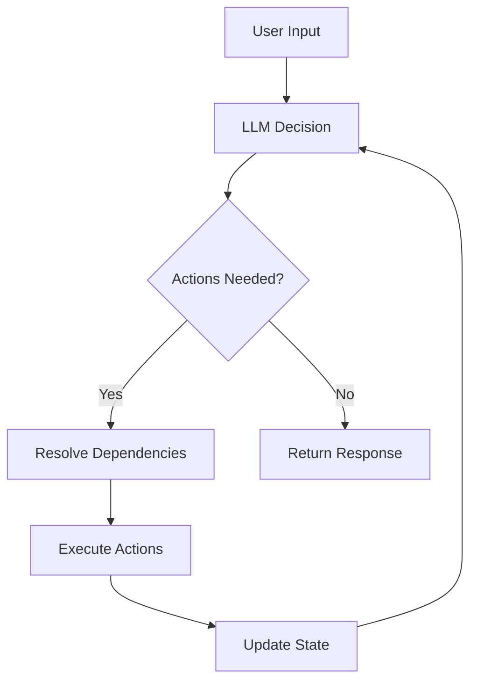

## What is the Task Loop?

The task loop is SpinAI's core decision-making process that:

- Analyzes user input
- Decides which actions to take
- Executes actions in order
- Determines when tasks are complete

## How it Works

1. **Decision Making**
   The LLM analyzes the input and available actions:

   ```typescript
   // LLM receives:
   - User's input
   - Available actions and their descriptions
   - Results from previous actions
   ```

2. **Action Selection**
   The LLM returns a decision:

   ```typescript
   interface LLMDecision {
     actions: string[]; // Actions to execute
     isDone: boolean; // Task completion status
     response: string; // Response to user
     reasoning?: string; // Optional explanation
     summary?: string; // Optional summary
   }
   ```

3. **Dependency Resolution**
   SpinAI orders the actions based on dependencies:

   ```typescript
   // Example dependency chain
   getCustomerInfo → validateSubscription → createTicket
   ```

4. **Action Execution**
   Actions run in order, sharing state through context:
   ```typescript
   // Each action:
   1. Receives the context
   2. Performs its task
   3. Updates the state
   4. Returns the modified context
   ```

## Integrating Gemini in Task Loops

With the addition of Gemini to SpinAI's suite of language learning models (LLMs), you can now leverage Google's Gemini for generating dynamic content within your task loops. This integration allows for more nuanced and contextually relevant responses, enhancing the decision-making capabilities of your SpinAI agents.

### Using Gemini for Dynamic Content Generation

To use Gemini within a task loop, you first need to create a Gemini LLM instance. This instance can then be used to generate content based on the current context of the task loop, providing tailored responses or actions.

```typescript
import { createGeminiLLM } from 'spinai';

const gemini = createGeminiLLM({
  apiKey: 'your_api_key_here',
  model: 'gemini-2.0-flash', // Optional: specify the model
});

async function generateContent(prompt: string) {
  const result = await gemini.complete({
    prompt,
    maxTokens: 1024,
    temperature: 0.7,
  });

  console.log(result.content); // Processed content
}
```

This example demonstrates how to initialize the Gemini LLM and request content generation, which can be integrated into any part of the task loop where dynamic, AI-generated content is beneficial.

## Decision Flow



## State Management

The task loop maintains state throughout the process:

```typescript
// Initial state
const context = {
  input: "user question",
  state: {},
};

// After actions run
const context = {
  input: "user question",
  state: {
    customerInfo: { ... },
    ticketId: "123",
    response: "I've created ticket #123",
  },
};
```

## Logging and Debugging

The task loop provides detailed logging:

```typescript
ℹ️ Processing request { input: "I need help" }
ℹ️ Planning next actions ["getCustomerInfo"]
ℹ️ Executing action: getCustomerInfo
ℹ️ Task complete { response: "I've found your info..." }
```

## Next Steps

<CardGroup>
  <Card title="Agents" icon="robot" href="/core-concepts/agents">
    Learn about agent configuration
  </Card>
  <Card title="Examples" icon="lightbulb" href="/examples">
    See real-world implementations
  </Card>
</CardGroup>